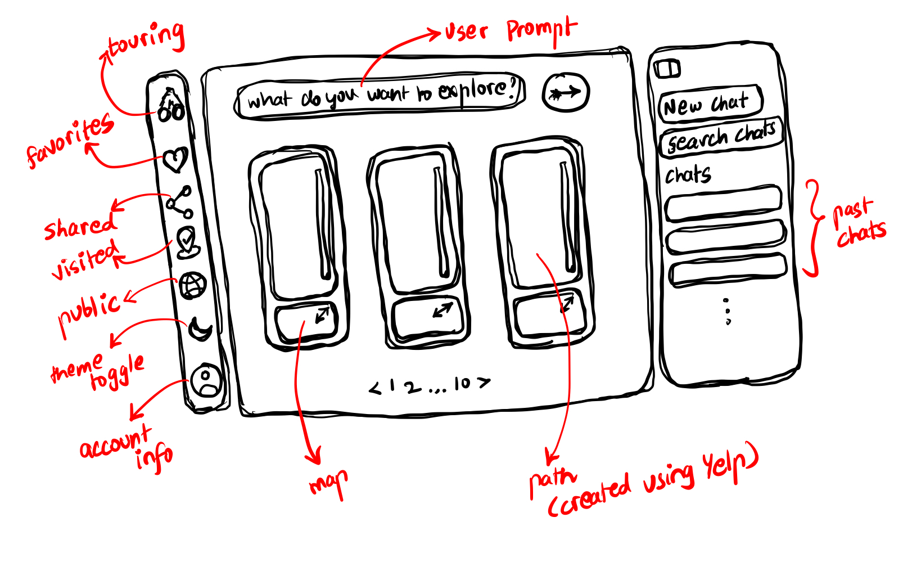
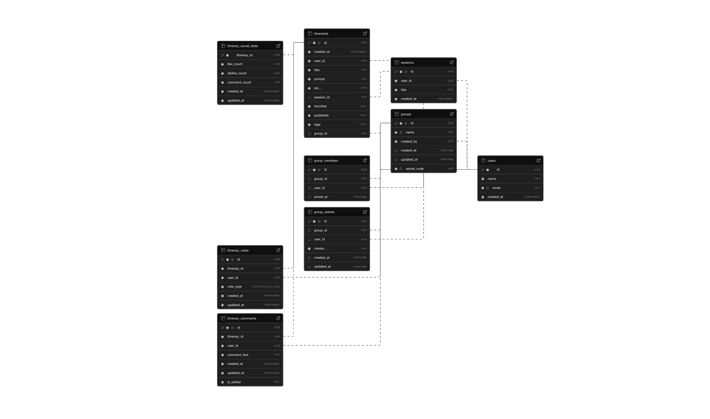

# 🌍 Odysseyelp

`Odysseyelp` is an AI-powered collaborative trip planning and discovery application that helps users create, share, and explore personalized and real-world location itineraries. It leverages Yelp Fusion API to fetch real-time business data (ratings, reviews, opening hours) for accurate travel recommendations, combined with the Google Gemini AI for structured response. This app features interactive mapping, group collaboration, and social discovery features.

---

## Core Features

### 1. **AI-Powered Itinerary Planning**

#### Chat Interface
- **Conversational Trip Planning**: Users interact with an AI assistant to generate travel itineraries
- **Natural Language Processing**: Describe your trip requirements in natural language and the AI understands context
- **Multi-Stop Itineraries**: Generate detailed itineraries with multiple stops/locations
- **Location Information**: Each stop includes location details, coordinates, and descriptions
- **Real-time Chat History**: View all previous conversations and generated itineraries

#### Session Management
- **Multiple Chat Sessions**: Create and manage multiple separate trip planning conversations
- **Session Persistence**: All sessions are saved and retrievable from chat history
- **Quick Access**: View recent trips directly from the sidebar
- **Session Deletion**: Remove unwanted chat sessions with one click

---

### 2. **Interactive Map Visualization**

#### Touring Map
- **Mapbox Integration**: High-quality mapping with Mapbox GL
- **Route Optimization**: Calculate the best route order to visit selected stops
- **GeoJSON Visualization**: Display itinerary stops and routes on an interactive map
- **Start Location Input**: Specify starting point for route optimization
- **Optimal Route Calculation**: Uses Mapbox Optimization API to determine the most efficient travel sequence

#### Map Controls
- Pan and zoom controls for exploration
- Visual representation of all planned stops
- Route geometry display showing the optimized path

---

### 3. **Calendar Planning**

#### Planner Calendar
- **Event-Based Planning**: Organize your trips by date
- **Drag-and-Drop Interface**: Easily reorganize trip events
- **Visual Calendar View**: See all planned trips at a glance
- **Date Selection**: Pick specific dates for your journey
- **Multi-Day Support**: Plan trips spanning multiple days

---

### 4. **Itinerary Management**

#### Itinerary Stops
- **Stop List Display**: View all stops in your itinerary
- **Stop Selection**: Mark which stops you want to visit
- **Stop Details**: View location information, coordinates, and descriptions
- **Stop Deletion**: Remove unwanted stops from your itinerary
- **Journey Timeline**: Visual timeline showing the sequence of stops

#### Itinerary Actions
- **Save to My Space**: Persist completed itineraries for later use
- **Modify Itinerary**: Edit and update planned trips
- **Route Planning**: Generate optimal routes between selected stops
- **Find Best Route**: One-click route optimization

---

### 5. **Personal Space (My Space)**

#### Itinerary Storage
- **Save Multiple Itineraries**: Store numerous trip plans for future reference
- **Easy Access**: Browse and organize saved trips
- **Quick View**: Preview trip details, stops, and maps
- **Plan Browsing**: Browse through multiple itineraries with a grid view
- **Plan Management**: Edit, delete, or modify saved itineraries

---

### 6. **Group Collaboration**

#### Group Creation & Management
- **Create Groups**: Start a new trip planning group
- **Unique Group Names**: Each group has a distinct name
- **Group Ownership**: Creator manages the group
- **Delete Groups**: Remove groups and associated data

#### Group Sharing
- **Secret Invite Code**: Generate unique codes for group members to join
- **Code Sharing**: Share secret codes with friends via any method
- **Secure Joining**: Users must provide the correct secret code to join a group

#### Group Members
- **Member List**: View all members in a group
- **Member Display**: See member names and join status
- **Current User Identification**: Marked with "(You)" badge in member list

#### Group Chat & Wishes
- **Shared Wishes**: Group members can contribute to a collective "wish list"
- **Collaborative Planning**: All members can add and view group wishes
- **Shared Context**: All group members see the same wish list updates
- **Organized Sidebar**: View group wishes in an organized sidebar panel

---

### 7. **Explore Page (Discovery)**

#### Browse Published Itineraries
- **Social Discovery**: Explore itineraries created and published by other users
- **Grid View**: Browse itineraries in a visually appealing card layout
- **User Information**: See who created each itinerary
- **Creator Details**: View user profiles and their published trips

#### Search Functionality
- **Fuzzy Search**: Find itineraries by title, user name, or tags
- **Real-time Search**: Results update as you type
- **Debounced Input**: Optimized search performance with 300ms delay

#### Sorting Options
- **Newest First**: Sort itineraries by most recent creation
- **Oldest First**: View earliest published itineraries
- **Most Stops**: Organize by complexity (number of stops)

#### Filtering & Discovery
- **Tag Filtering**: Filter itineraries by associated tags
- **Multi-Select Tags**: Filter by multiple tags simultaneously
- **Tag Frequency**: See how many itineraries have each tag
- **Advanced Filtering**: Combine search with tag filters for precise discovery

#### Itinerary Details
- **Quick Preview**: View full itinerary details in a modal
- **Stop Timeline**: See all stops in chronological order
- **Map View**: Visualize the route on an interactive map
- **Creator Info**: View information about the trip creator

---

### 8. **User Authentication & Accounts**

#### Account Management
- **Secure Authentication**: Supabase auth integration
- **User Registration**: Create new accounts with email and password
- **User Login**: Secure login with email credentials
- **Profile Information**: Store user name and email
- **Session Management**: Track active user sessions

#### User Profile
- **User Context**: Maintain user state across the application
- **Personalized Experience**: Customize interface based on user data
- **Privacy**: User-specific data access and permissions

---

### 9. **UI/UX Features**

#### Navigation & Layout
- **Sidebar Navigation**: Quick access to chats, groups, and main sections
- **Dashboard Layout**: Organized dashboard with multiple sections
- **Shell Layout**: Consistent layout structure across pages
- **Header Controls**: Contextual actions and navigation options

#### Visual Design
- **Dark/Light Theme**: Toggle between dark and light modes
- **System Theme**: Automatic theme based on system preferences
- **Responsive Design**: Works seamlessly on desktop and tablet screens
- **Smooth Animations**: Framer Motion animations for polish and feedback

#### Interactive Elements
- **Hover Effects**: Visibility hints for interactive elements
- **Toast Notifications**: User feedback for actions (success, error, info)
- **Loading States**: Clear loading indicators during async operations
- **Modal Dialogs**: Confirmation dialogs for destructive actions
- **Dropdown Menus**: Quick access to options and actions

#### Accessibility
- **Keyboard Navigation**: Tab through interactive elements
- **ARIA Labels**: Proper accessibility markup
- **Color Contrast**: High contrast for readability
- **Form Validation**: Clear validation feedback

---

### 10. **Data Management**

#### Database Backend (Supabase)
- **PostgreSQL Database**: Reliable data persistence
- **Real-time Sync**: Live data updates across sessions
- **User Authentication**: Secure user management
- **RPC Functions**: Custom database procedures for complex operations

#### Data Storage
- **Users Table**: Store user accounts and profiles
- **Sessions Table**: Save chat sessions
- **Itineraries Table**: Store trip plans and stops
- **Groups Table**: Manage group information
- **Group Members Table**: Track group memberships
- **Relationships**: Foreign key constraints for data integrity

#### Data Types
- **JSON Stops**: Store complex stop information as JSON
- **Coordinates**: Precise location coordinates (longitude, latitude)
- **Timestamps**: Track creation and modification times
- **User Associations**: Link data to specific users

---

## User Workflows

### Workflow 1: Planning a Trip
1. Start a new chat session
2. Describe your trip requirements to the AI
3. AI generates an itinerary with multiple stops
4. Review the stops and timeline
5. Input a starting location
6. Generate an optimized route
7. View the route on the map
8. Save the itinerary to My Space

### Workflow 2: Discovering & Sharing Trips
1. Browse the Explore page to discover user-created itineraries
2. Search for specific types of trips using keywords
3. Filter by tags to narrow results
4. Click on an itinerary to view full details
5. See the route and stops on the map
6. Share the itinerary with friends via groups

### Workflow 3: Collaborative Group Planning
1. Create a new group for your trip
2. Generate an invite code
3. Share the code with trip companions
4. Companions join using the code
5. All members can view and add to group wishes
6. Coordinate trip planning with all members
7. View the complete group plan on the map

### Workflow 4: Managing Multiple Trips
1. Create multiple chat sessions for different trips
2. View chat history with quick access to recent trips
3. Save favorite itineraries to My Space
4. Organize trips by theme or destination
5. Retrieve and modify saved plans as needed
6. Share trips with others or keep private

---

## Technical Architecture

### Frontend Stack
- **Framework**: Next.js 16 (React 19)
- **Language**: TypeScript
- **Styling**: Tailwind CSS
- **UI Components**: Radix UI, Base UI
- **Maps**: Mapbox GL
- **State Management**: React Context API
- **Form Handling**: React Hook Form
- **Animations**: Framer Motion
- **Notifications**: Sonner toast library
- **Database Client**: Supabase JS

### Key Components
- **Shell Layout**: Main application wrapper
- **Sidebar**: Navigation and quick access
- **Chat Interface**: AI conversation and history
- **Map Viewer**: Interactive route visualization
- **Calendar**: Date-based event planning
- **Grid Views**: Itinerary browsing
- **Modal Dialogs**: Detail views and confirmations
- **Filter Bars**: Search and tag filtering

### API Integration
- **Google Generative AI**: Natural language processing for itinerary generation
- **Mapbox API**: Route optimization and map rendering
- **Supabase**: Database and authentication backend

---

## Security & Privacy

### User Data Protection
- **Authenticated Access**: Login required for all features
- **User Isolation**: Users can only access their own data
- **Secure Codes**: Secret invite codes for group access
- **Database Constraints**: Foreign keys enforce data relationships

### Privacy Controls
- **Public/Private**: Itineraries can be private or published
- **Group Privacy**: Group members only see group data
- **Personal Space**: Private storage of itineraries

---

## Performance Optimizations

### Frontend Optimizations
- **Debounced Search**: Reduces API calls and re-renders
- **Lazy Loading**: Load components and data on demand
- **Memoization**: Prevent unnecessary re-renders
- **Responsive Images**: Optimized image delivery

### Data Fetching
- **Efficient Queries**: Optimized database queries
- **Pagination**: Handle large datasets efficiently
- **Real-time Updates**: Live data synchronization where appropriate

---

## Future Enhancement Possibilities

- **Social Features**: Advanced user profiles, followers, activity feeds
- **Advanced Filtering**: More granular search and filter options
- **Mobile App**: Native iOS/Android applications
- **Offline Mode**: Work offline with sync when online
- **Analytics**: Track popular destinations and routes
- **Personalization**: Recommendations based on user preferences
- **Integration**: Connect with booking platforms for flights/hotels
- **Export**: Download itineraries in various formats (PDF, iCal, etc.)

---

## Getting Started

### Prerequisites
- Node.js and pnpm
- Supabase account and project
- Mapbox API key
- Google Gemini API key

### Installation
```bash
cd my-app
pnpm install
pnpm dev
```

### Configuration
Set up environment variables for:
- Supabase URL and key
- Mapbox token
- Google Generative AI API key

---

## Support & Feedback

For issues, feature requests, or feedback, please contact the development team or visit the project repository.

---

## 🛠️ Technical Stack

* **Frontend**: Typescript, Next.js 16 (App Router), React, Tailwind CSS, Shadcn UI
* **Backend**: Typescript, Next.js 16
* **Database**: Supabase PostgreSQL
* **Authentication**: Supabase Auth, Realtime
* **Realtime**: Supabase Realtime.
* **AI & Data**:  Yelp AI API (Place Data), Google Gemini API (Logic & Structuring)

---

## Initial Layout Planning:

### Chat Layout:


## Touring Page:


---
## Database Planning:

### ER Diagram:


### Database Design:


### Database Schema:
```SQL
-- WARNING: This schema is for context only and is not meant to be run.
-- Table order and constraints may not be valid for execution.

CREATE TABLE public.group_members (
  id bigint GENERATED ALWAYS AS IDENTITY NOT NULL,
  group_id bigint,
  user_id uuid,
  joined_at timestamp without time zone DEFAULT now(),
  CONSTRAINT group_members_pkey PRIMARY KEY (id),
  CONSTRAINT group_members_group_id_fkey FOREIGN KEY (group_id) REFERENCES public.groups(id),
  CONSTRAINT group_members_user_id_fkey1 FOREIGN KEY (user_id) REFERENCES public.users(id)
);
CREATE TABLE public.group_wishes (
  id bigint GENERATED ALWAYS AS IDENTITY NOT NULL,
  group_id bigint,
  user_id uuid,
  message text NOT NULL,
  created_at timestamp without time zone DEFAULT now(),
  updated_at timestamp without time zone DEFAULT now(),
  CONSTRAINT group_wishes_pkey PRIMARY KEY (id),
  CONSTRAINT group_wishes_group_id_fkey FOREIGN KEY (group_id) REFERENCES public.groups(id),
  CONSTRAINT group_wishes_user_id_fkey1 FOREIGN KEY (user_id) REFERENCES public.users(id)
);
CREATE TABLE public.groups (
  id bigint GENERATED ALWAYS AS IDENTITY NOT NULL,
  name text NOT NULL UNIQUE,
  created_by uuid NOT NULL,
  created_at timestamp without time zone DEFAULT now(),
  updated_at timestamp without time zone DEFAULT now(),
  secret_code uuid NOT NULL DEFAULT gen_random_uuid() UNIQUE,
  CONSTRAINT groups_pkey PRIMARY KEY (id),
  CONSTRAINT groups_created_by_fkey1 FOREIGN KEY (created_by) REFERENCES public.users(id)
);
CREATE TABLE public.itineraries (
  id bigint GENERATED ALWAYS AS IDENTITY NOT NULL,
  created_at timestamp with time zone NOT NULL DEFAULT now(),
  user_id uuid NOT NULL,
  title text NOT NULL,
  prompt text NOT NULL,
  stops jsonb NOT NULL,
  session_id bigint,
  favorites boolean NOT NULL DEFAULT false,
  published boolean NOT NULL DEFAULT false,
  tags ARRAY NOT NULL DEFAULT '{}'::text[],
  group_id bigint,
  CONSTRAINT itineraries_pkey PRIMARY KEY (id),
  CONSTRAINT itineraries_user_id_fkey FOREIGN KEY (user_id) REFERENCES public.users(id),
  CONSTRAINT itineraries_session_id_fkey FOREIGN KEY (session_id) REFERENCES public.sessions(id),
  CONSTRAINT itineraries_group_id_fkey FOREIGN KEY (group_id) REFERENCES public.groups(id)
);
CREATE TABLE public.itinerary_comments (
  id bigint GENERATED ALWAYS AS IDENTITY NOT NULL,
  itinerary_id bigint NOT NULL,
  user_id uuid NOT NULL,
  comment_text text NOT NULL CHECK (char_length(comment_text) > 0 AND char_length(comment_text) <= 2000),
  created_at timestamp with time zone NOT NULL DEFAULT now(),
  updated_at timestamp with time zone NOT NULL DEFAULT now(),
  is_edited boolean NOT NULL DEFAULT false,
  CONSTRAINT itinerary_comments_pkey PRIMARY KEY (id),
  CONSTRAINT itinerary_comments_itinerary_id_fkey FOREIGN KEY (itinerary_id) REFERENCES public.itineraries(id),
  CONSTRAINT itinerary_comments_user_id_fkey FOREIGN KEY (user_id) REFERENCES public.users(id)
);
CREATE TABLE public.itinerary_social_stats (
  itinerary_id bigint NOT NULL,
  like_count integer NOT NULL DEFAULT 0,
  dislike_count integer NOT NULL DEFAULT 0,
  comment_count integer NOT NULL DEFAULT 0,
  created_at timestamp with time zone NOT NULL DEFAULT now(),
  updated_at timestamp with time zone NOT NULL DEFAULT now(),
  CONSTRAINT itinerary_social_stats_pkey PRIMARY KEY (itinerary_id),
  CONSTRAINT itinerary_social_stats_itinerary_id_fkey FOREIGN KEY (itinerary_id) REFERENCES public.itineraries(id)
);
CREATE TABLE public.itinerary_votes (
  id bigint GENERATED ALWAYS AS IDENTITY NOT NULL,
  itinerary_id bigint NOT NULL,
  user_id uuid NOT NULL,
  vote_type USER-DEFINED NOT NULL,
  created_at timestamp with time zone NOT NULL DEFAULT now(),
  updated_at timestamp with time zone NOT NULL DEFAULT now(),
  CONSTRAINT itinerary_votes_pkey PRIMARY KEY (id),
  CONSTRAINT itinerary_votes_itinerary_id_fkey FOREIGN KEY (itinerary_id) REFERENCES public.itineraries(id),
  CONSTRAINT itinerary_votes_user_id_fkey FOREIGN KEY (user_id) REFERENCES public.users(id)
);
CREATE TABLE public.sessions (
  id bigint GENERATED ALWAYS AS IDENTITY NOT NULL,
  user_id uuid NOT NULL,
  title text NOT NULL,
  created_at timestamp with time zone NOT NULL DEFAULT now(),
  CONSTRAINT sessions_pkey PRIMARY KEY (id),
  CONSTRAINT sessions_user_id_fkey FOREIGN KEY (user_id) REFERENCES public.users(id)
);
CREATE TABLE public.users (
  id uuid NOT NULL,
  name text NOT NULL,
  email text NOT NULL UNIQUE,
  created_at timestamp with time zone NOT NULL DEFAULT now(),
  CONSTRAINT users_pkey PRIMARY KEY (id)
);
```
